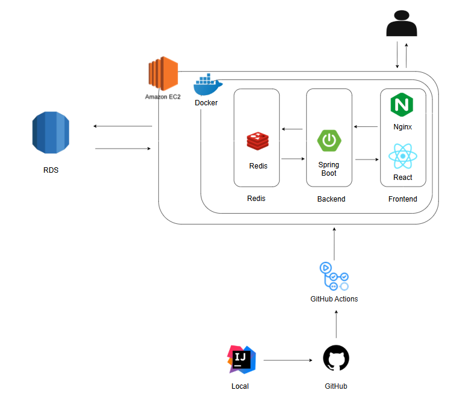
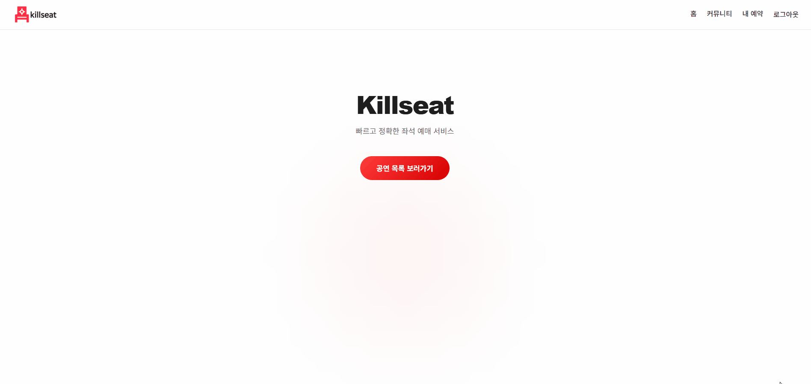
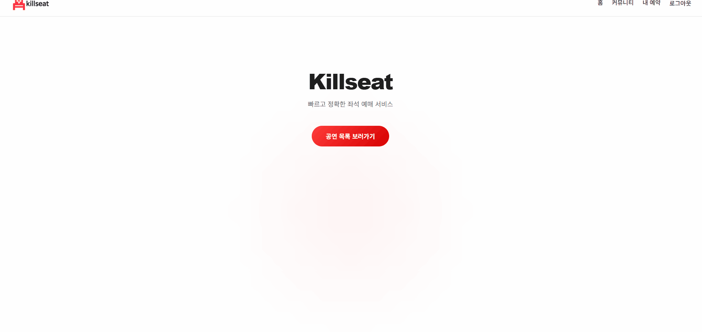
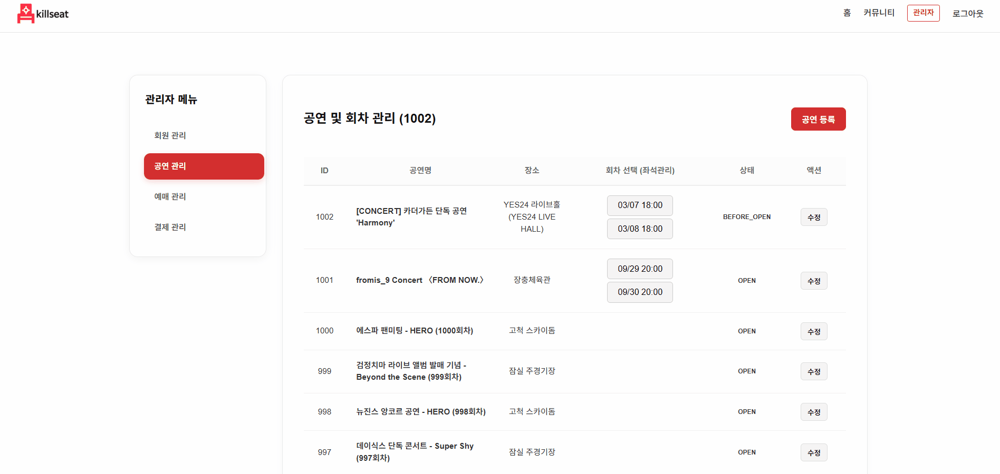
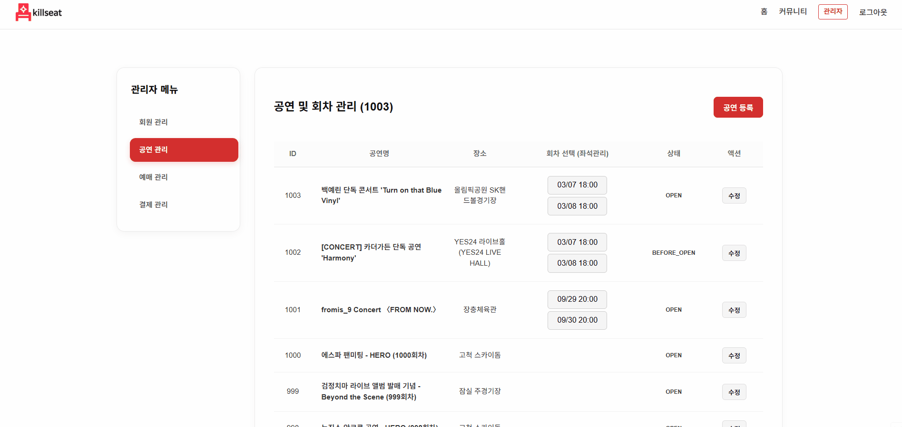
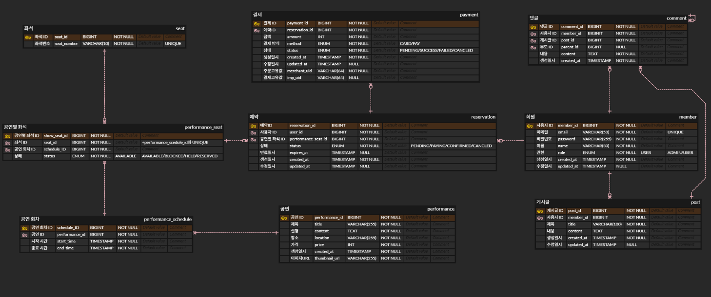

# KillSeat: 공연 예매 플랫폼

* **배포 주소**: http://killseat.kro.kr
* **API 문서**: http://killseat.kro.kr:8080/swagger-ui/index.html

---

## 1. 프로젝트 개요

KillSeat은 사용자가 공연 정보를 조회하고 좌석을 선택해 자리를 예매할 수 있는 공연 예매 플랫폼.

---

## 2. 기술 스택

### Development
* **Frontend**: React (Vite)
* **Backend**: Java 21, Spring Boot 3.5.5, Spring Data JPA
* **Database**: MySQL 8.0
* **Cache**: Redis

### Infrastructure & DevOps
* **Server**: AWS EC2 (t3a.small)
* **Container**: Docker
  * frontend: React + Nginx
  * backend: Spring Boot
  * redis: Redis
* **CI/CD**: GitHub Actions
* **Test**: k6

---

## 3. 시스템 아키텍처

---

## 4. [공연 목록] Redis 기반 공연 목록 조회

공연 목록 조회 시 발생하는 DB 병목을 확인하고, Redis를 통해 성능을 개선함.
* **테스트 대상**: 공연 목록 조회 (더미 데이터 1000건)
* **테스트 환경**: AWS t3a.small

### 4-1. DB 환경의 한계 (VU 200)
DB 기반 공연 목록 조회 시 200명의 가상 사용자만으로도 응답 시간이 급격히 지연되는 병목 현상이 생김.

| 측정 지표 | DB |
| :--- | :--- |
| **Throughput (TPS)** | 114.2/s |
| **p(95) Response Time** | 722.98ms |

### 4-2. Redis 도입 결과 비교 (VU 200)
공연 목록 조회에 Redis를 도입한 결과, 동일 부하 환경에서 더 나은 성능 향상을 기록함.

| 측정 지표 | DB 조회 | Redis 캐시 적용 | 개선 효과 |
| :--- | :--- | :--- | :--- |
| **Throughput (TPS)** | 114.2/s | 149.5/s | **31% 향상** |
| **p(95) Response Time** | 722.98ms | 6.78ms | **99% 단축** |

### 4-3. Redis 한계 지점 테스트 (VU 1200)
시스템의 응답 지연이 급격히 증가하는 구간을 확인하기 위해 찾기 위해 부하를 최대 1200 VU까지 늘림.

| 측정 지표 | Redis 적용 (VU 1200)  |
| :--- | :--- |
| **Throughput (TPS)** | 1,654.7/s |
| **p(95) Response Time** | 381.92ms |
| **Error Rate** | 0.00% |

* **결과**:  VU 1000명 기점부터 p(95) 지연 시간이 381.92ms로 증가하는 성능 변곡점을 발견함.

---

## 5. [대기열] Redis & SSE 기반 대기열
Redis와 SSE를 결합하여, 티켓 오픈 시점에 발생하는 순간적인 트래픽을 제어하기 위한 대기열 시스템을 구축함.

### 5-1. 시스템 아키텍처 및 흐름
1. **대기열 진입**  
   예약 요청은 즉시 처리되지 않고 Redis의 Sorted Set에 진입하며, 선착순 순번을 관리함.  
2. **실시간 통신**  
   SSE(Server-Sent Events)를 사용해 서버와의 연결을 유지하며, 사용자는 자신의 대기 순번 변화를 실시간으로 확인함.

### 5-2. 이점
* **트래픽 완화**: 예약 서버로 유입되는 동시 요청 수를 제어해, 폭주 상황에서도 시스템 안정성을 유지함.
* **UX 개선**: 새로고침 없이 실시간으로 대기 순번을 제공하여 사용자 경험을 향상시킴.

---

## 6. [예약] 비관적 락 및 인덱스 최적화

동시성 요청이 집중되는 예약 로직에서 데이터 무결성을 확보하고, 인덱스를 적용시켜 좌석 데이터 조회 효율을 높임.

### 6-1. 비관적 락(Pessimistic Lock) 적용
* **목적**: 동일 좌석에 대한 중복 예매 발생 가능성을 차단.
* **이유**: 트래픽 밀집 상황에서 재시도 비용이 발생하는 낙관적 락보다 서비스 안정성 면에서 유리하다고 판단.
* **결과**: 동시성 테스트를 통해 중복 예매 발생 0건 확인.

### 6-2. 인덱스 활용을 통한 시스템 최적화
* **목적**: 좌석 데이터 조회 효율화.
* **방법**: 회차 ID 및 좌석 상태 필드에 인덱스를 구성함.
* **이점**: 
    - **예약 진입 속도 향상**: 사용자가 공연 회차를 선택했을 때, 많은 좌석 데이터 중 해당 회차의 좌석들만 인덱스를 통해 추출하여 좌석 배치도 로딩 속도를 최적화.
    - **좌석 상태 필터링**: 예약 가능 상태인 좌석만 빠르게 골라내어 DB의 부하를 줄이고, 트래픽이 몰리는 상황에서도 조회 성능을 유지하게 함.

---

## 7. [운영] 관리자 메뉴
운영 효율성을 높이기 위한 관리자 메뉴 구축.

* **회원 조회**: 전체 유저 목록 조회.
* **공연 및 회차 관리**: 공연 등록 및 수정, 공연 회차별 스케줄(Date/Time) 관리.
* **좌석 제어**: 관리자 페이지 내 배치도 UI를 통해 특정 좌석을 직접 선택하여 판매 가능/차단 상태를 즉시 토글.
* **예약 및 결제 내역**: 전체 예약 및 결제 내역 조회.
---

## 8. 주요 기능 시연

### 서비스 실행 화면
| 티켓 예매 프로세스 | 커뮤니티 게시판 |
| :---: | :---: |
|  |  |
| 비관적 락을 통한 중복 예매 방지 및 포트원 연동 결제 처리 | 공연 후기 및 정보 공유를 위한 기본 게시판 기능 |

| 공연 등록 및 수정 | 좌석 상태 제어 |
| :---: | :---: |
|  |  |
| 공연 정보 등록 및  공연 정보 수정 | 현장 판매 및 안전 구역 확보를 위한 특정 좌석 예약 제어 |

---

## 9. ERD

